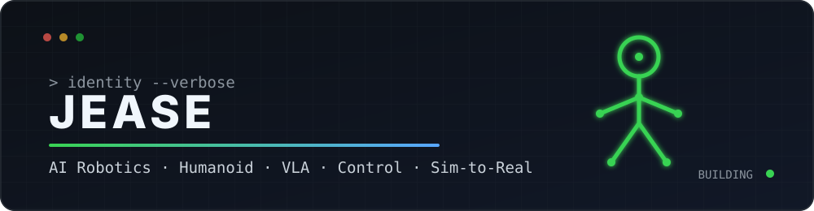
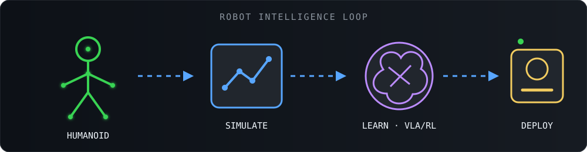
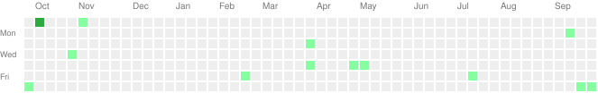
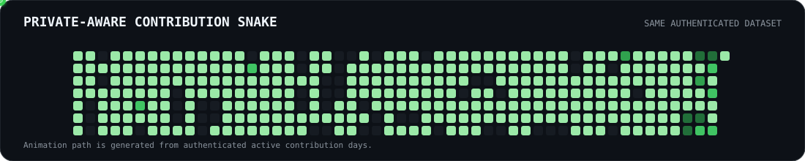
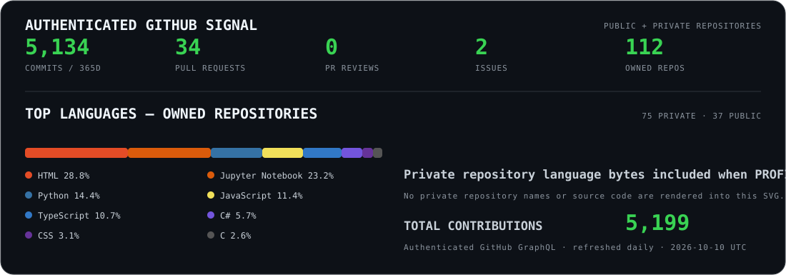

<div align="center">



<br/>


<p>
  <a href="https://github.com/jease0502?tab=followers">
    
  </a>
</p>

</div>

---

## 🤖 What I Build

I work across the full robotics stack — from **actuators and real-time control** to **simulation, reinforcement learning, VLA, and Sim-to-Real deployment**.

<div align="center">
  
</div>

<br/>

<table>
<tr>
<td width="25%" align="center"><b>🤖 Humanoid</b><br/>Joint modules<br/>Motion control<br/>Whole-body systems</td>
<td width="25%" align="center"><b>🧠 Embodied AI</b><br/>VLA<br/>Imitation Learning<br/>Reinforcement Learning</td>
<td width="25%" align="center"><b>🧪 Simulation</b><br/>Isaac Sim<br/>Isaac Lab<br/>Sim-to-Real</td>
<td width="25%" align="center"><b>⚙️ Control</b><br/>ROS 2<br/>PID / Impedance<br/>Real-time systems</td>
</tr>
</table>

---

# 🟩 Contribution Wall

<div align="center">

### Full GitHub activity — authenticated public + private counts.

<picture>
  <source media="(prefers-color-scheme: dark)" srcset="./assets/contribution-wall.svg">
  
</picture>

<sub>Generated daily from authenticated GitHub GraphQL. Private/internal contribution counts can be included without exposing private repository names or code.</sub>

</div>

---

## 🐍 Contributions, but alive

<div align="center">
  
  <sub>Generated from the same authenticated public + private contribution calendar.</sub>
</div>

---

## 🛠 Engineering Stack

<div align="center">


<br/><br/>

`ROS 2` · `Isaac Sim` · `Isaac Lab` · `PyTorch` · `CUDA` · `C++` · `Python` · `Docker` · `Linux` · `TypeScript`

</div>

---

## 🚀 Current Focus

```text
HUMANOID ROBOTICS
├── Joint & actuator modules
├── Real-time motor control
├── Dual-arm manipulation
└── Whole-body systems

EMBODIED AI
├── Vision-Language-Action
├── Imitation Learning
├── Reinforcement Learning
└── Temporal / action representation

SIMULATION → REAL
├── NVIDIA Isaac Sim
├── Isaac Lab
├── ROS 2 integration
└── Sim-to-Real deployment
```

---

## 📊 GitHub Signal

<div align="center">



<sub>Stats and language mix are generated from authenticated GitHub GraphQL, including private owned repositories when the PAT has access.</sub>

</div>

---

<div align="center">

### `SYSTEM STATUS`

`ROS2 ● ONLINE` &nbsp; `ISAAC ● ONLINE` &nbsp; `HUMANOID ● BUILDING` &nbsp; `VLA ● TRAINING...`

<br/>

**Building intelligent machines from silicon to motion.**

</div>
